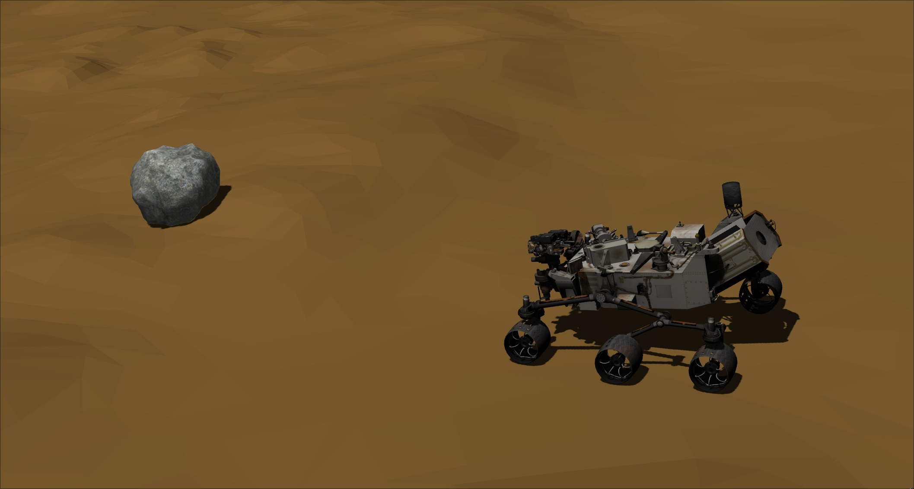
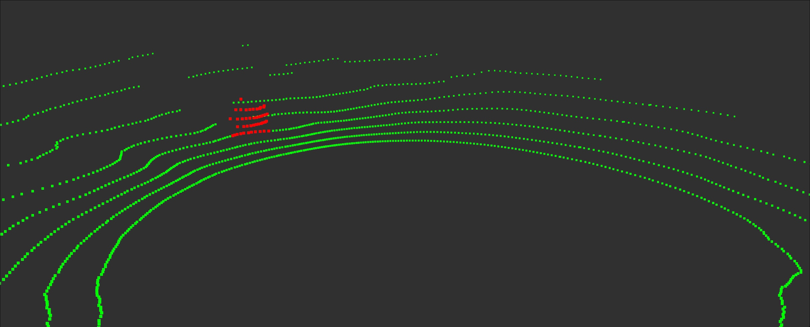

# Angle based obstacle detection.

## Overview
This package provides 360-lidar obstacle detection algorithm for ROS noetic.
This algorithm checks local curvature of a surface to detect obstacles in lidar point cloud.
The algorithm considers all slopes on the point cloud and returns points of 
steep hills as obstacle points. Thus this algorithm works bad if there is noise in lidar data. 
This package provides publisher of all obstacles
and publisher of *dangerous obstacles* which are in the sector of circle in front of lidar. 
In the launch file you can define:
* minimal angle of slope required to call it an obstacle `obstacle_angle_thrsh`
* angle of sector in which obstacles will be called *dangerous* `obstacle_sector_angle`
* radius of sector in which obstacles will be called *dangerous* `obstacle_sector_radius`

Rock on the Mars                           |  Segmentated rock
:-----------------------------------------:|:-----------------------------------------:
  |  

## Dependencies.
* Depends on [PCL](https://github.com/PointCloudLibrary/pcl) to work with point clouds
* Depends on [perception_pcl](https://github.com/ros-perception/perception_pcl) to convert point clouds classes between ROS and PCL

## Subscribers and publishers.
* This node subscribes to `velodyne_points` for lidar point cloud.
* `obstacle_pub` publishes cloud of detected obstacles. 
* `dangerous_obstacle_pub` publishes subcloud of obstacles defined by rosparams (check launch file). 
* `avoid_obstacles` publishes `True` if *dangerous_obstacle* cloud is not empty. 

## Quick start
* 
